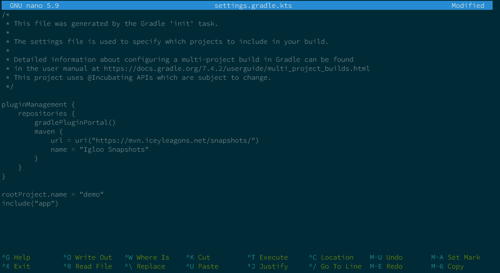

# Get Started

[Icicle ](https://icicle.iceyleagons.net)is a Spring inspired framework designed for Bukkit/Spigot plugin development. It's a new way of thinking about plugin development, and not worrying about the complex systems you have to write for many hours straight.

The aim of this project is to aid you in every single part of plugin development, from basic commands to advanced protocol mechanics.


Even though Icicle can be implemented in many environments, we'll only focus on Minecraft development in this documentation. If you're interested in gaining the basic (non-Minecraft) functionalities of Icicle, please check out the[ Embedding Icicle](embedding-icicle.md) page.


### Learning the Fundamentals

* If you're already familiar with the concept of beans, or with Spring, then you will have no time picking up Icicle's style.
* If you have never heard of the things above, then don't feel disqualified. In this documentation, we will explain everything in a nutshell, so that you will understand the "weird terms" we will reference/rely on.

We've split the documentation into sections. These sections include the complete guide of separate modules, how to extend Icicle, etc. However, if you're new to Icicle (or have no idea about Spring either) we strongly recommend starting with the basics under [Icicle Basics](broken-reference).

### Create your first Icicle application

Create your first Icicle application very easily.

#### Setting up your development environment

To help your productivity skyrocket, we've decided to make our own development tools, with many in mind for the future.

Currently, our only development tool is our own Gradle Plugin, but don't let this little number fool you, this addon for Gradle will help you more than you can imagine, but let's dive into it further!


We strongly recommend the use of Gradle, but you can get away with Maven or the dependency manager of your choice, but you will lose the helpful features of our plugin.








You want to use Eclipse, I see. Teach you how to do so, I shall.

Fire up Eclipse and create a new Project with `CTRL+N`, or by clicking on `File -> New -> Other`.


This will bring up a handy little wizard, where the only thing I care about is the `Gradle -> Gradle Project`.


a



## Basic Gradle project setup

First of all, we need to create the folder containing our project

```shell-session
$ mkdir demo
$ cd demo
```

Next we'll start creating the project with Gradle. This needs to be unzipped and added to the environment variables. To start the creation process we'll need to execute

```shell-session
$ gradle init
```

This will give us some options which we'll quickly answer. In this demo we'll be using a Kotlin DSL.

```
Select type of project to generate:
  1: basic
  2: application
  3: library
  4: Gradle plugin
Enter selection (default: basic) [1..4] 2

Select implementation language:
  1: C++
  2: Groovy
  3: Java
  4: Kotlin
  5: Scala
  6: Swift
Enter selection (default: Java) [1..6] 3

Split functionality across multiple subprojects?:
  1: no - only one application project
  2: yes - application and library projects
Enter selection (default: no - only one application project) [1..2] 1

Select build script DSL:
  1: Groovy
  2: Kotlin
Enter selection (default: Groovy) [1..2] 2

Generate build using new APIs and behavior(default: no) [yes, no] yes

Select test framework:
  1: JUnit 4
  2: TestNG
  3: Spock
  4: JUnit Jupiter
Enter selection (default: JUnit Jupiter) [1..4] 1

Project name (default: demo):
Source package (default: demo):
```

After we've finished setting up our basic file structure, we can go ahead and add all the icicle related funky stuff!

## Plugin setup preparations

With your preferred text editor open up the `settings.gradle.kts` file. For the sake of presentation, I'll be using nano.

```shell-session
$ nano settings.gradle.kts
```

In there copy-paste the following text:

```kts
pluginManagement {
    repositories {
        gradlePluginPortal() // Default plugin portal so everything still works.
        maven { // Custom repository so you can access the icicle plugin.
            url = uri("https://mvn.iceyleagons.net/snapshots/")
            name = "Igloo Snapshots"
        }
    }
}
```



Inside of your `plugins` block, add the icicle plugin with the following bit of code.

```kts
id("net.iceyleagons.icicle-gradle") version "1.5-SNAPSHOT"
```

## Configuration of the plugin

Next up, let's create the configuration for the Icicle plugin.

Create a new block, called `icicle` and populate it according to the template provided below.

```kts
icicle {
    name = "Demo project"
    version = project.version.toString() // or anything that's a string
    description = "This is a short description for a small project"
    developers = listOf("me")
}
```


